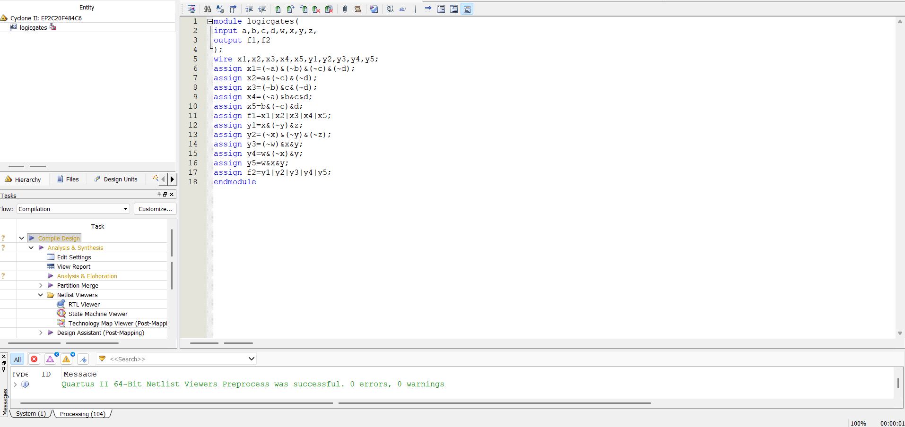
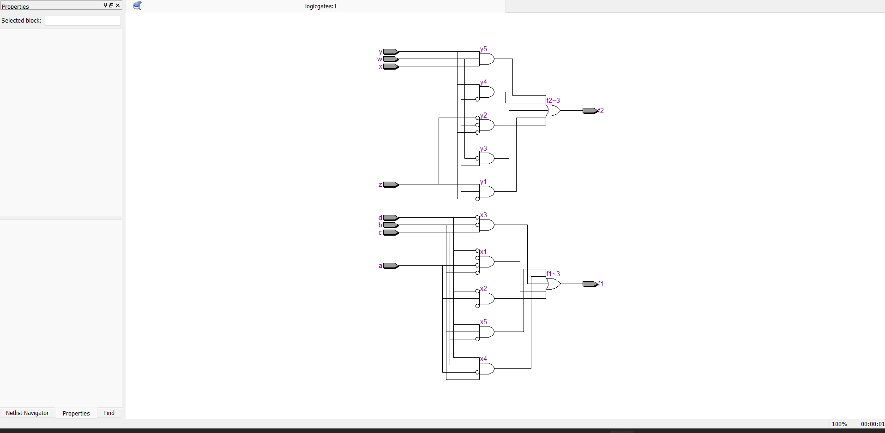
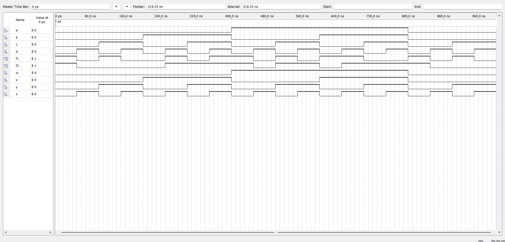
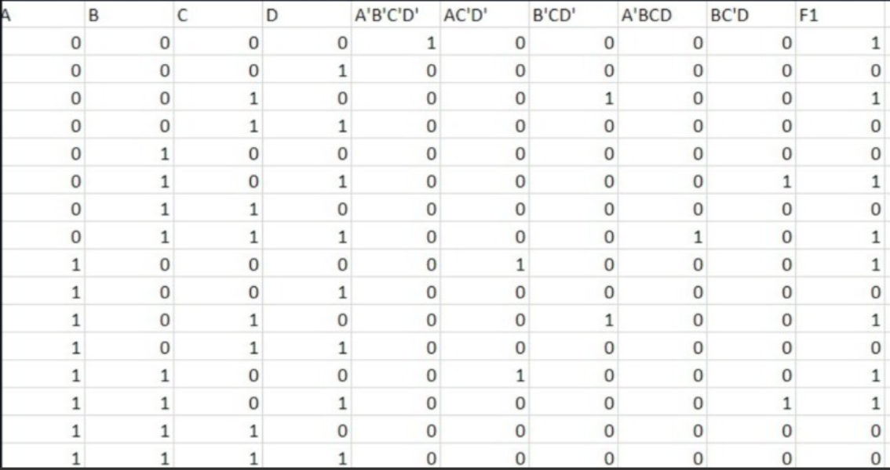
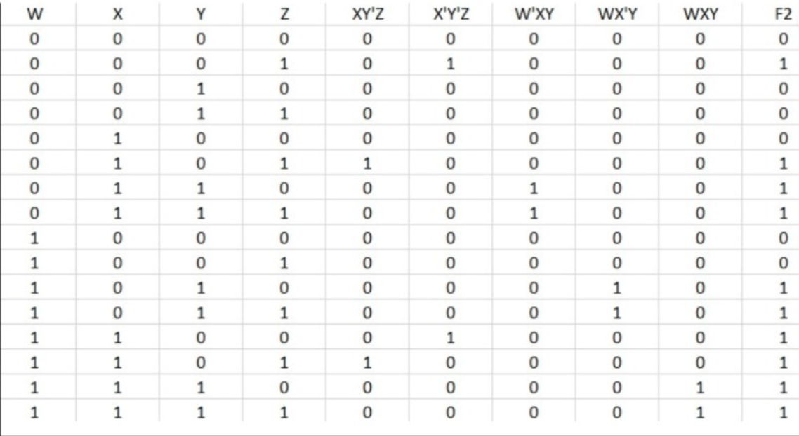

# BOOLEAN_FUNCTION_MINIMIZATION

**AIM:**

To implement the given logic function verify its operation in Quartus using Verilog programming.

F1= A’B’C’D’+AC’D’+B’CD’+A’BCD+BC’D 

F2=xy’z+x’y’z+w’xy+wx’y+wxy

**Equipment Required:**

Hardware – PCs, Cyclone II , USB flasher

**Software – Quartus prime**

**Theory**

**Logic Diagram**

**Procedure**

1.	Type the program in Quartus software.

2.	Compile and run the program.

3.	Generate the RTL schematic and save the logic diagram.

4.	Create nodes for inputs and outputs to generate the timing diagram.

5.	For different input combinations generate the timing diagram.

**Program:**

Program to implement the given logic function and to verify its operations in quartus using Verilog programming. 

Developed by: SWATHI P.N RegisterNumber: 25008251

**RTL realization**

**Output:**

**Timing Diagram**

**Result:**

Thus the given logic functions are implemented using and their operations are verified using Verilog programming.

